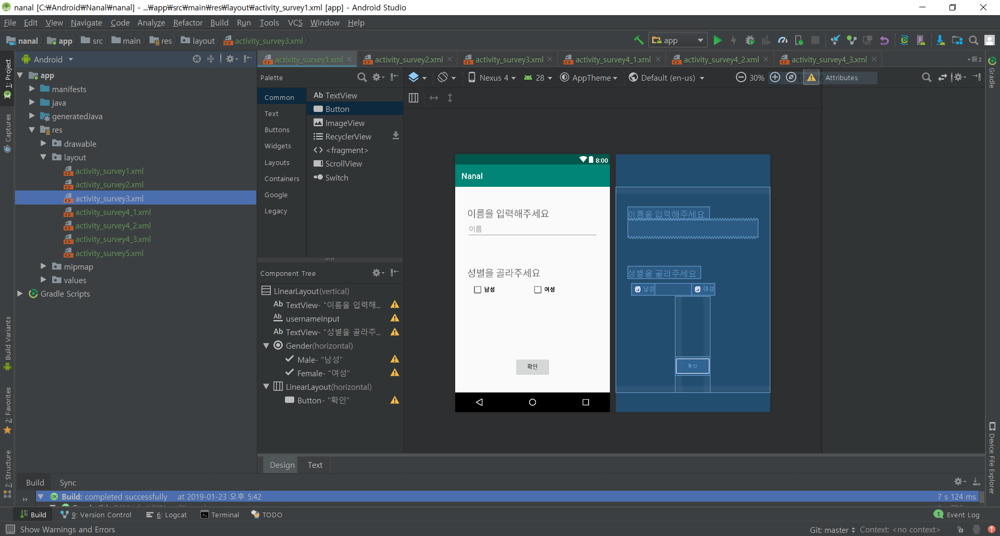
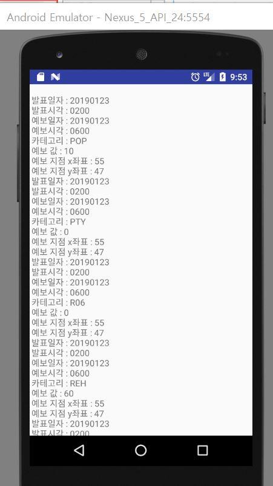

# 1월 23일

* __강나래__
  * 사용자가 원하는 정보, 체질과 같은 사용자의 정보를 수집하는 __뷰__ 를 짬.
  * 
  
  
* __이민희__
  * 날씨정보를 가져와서 옷 추천을 해주는 메인화면 등 __여러 화면들의 뷰__ 를 짬
  * 개인 맞춤화 정보를 제공해주기 위해, 개인 의 정보를 저장할 __쉐어드 프리퍼런스를 구축__ 함.
  * 
  
* __이민지__
  * 날씨 정보 API를 __파싱__ 하여 정보를 분리하였음.
  * 날씨 정보를 시각적으로 쉽게 표현하기 위한 __그림__ 을 제작.
  * 
  
